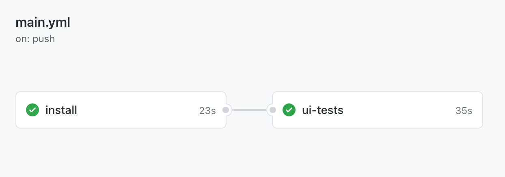

# cypress-gh-action-split-jobs
[![renovate-app badge][renovate-badge]][renovate-app] [![ci status][ci image]][ci url] 
> Example with separate install and test jobs using [Cypress GitHub Action](https://github.com/cypress-io/github-action)

This example shows how to install all dependencies and build the site in one job, while running the tests in another. See the [.github/workflows/main.yml](./.github/workflows/main.yml) file.

Watch video explaining the workflow at [https://youtu.be/62cDLO533OY](https://youtu.be/62cDLO533OY)

[ci image]: https://github.com/bahmutov/cypress-gh-action-split-jobs/workflows/main/badge.svg?branch=main
[ci url]: https://github.com/bahmutov/cypress-gh-action-split-jobs/actions
[renovate-badge]: https://img.shields.io/badge/renovate-app-blue.svg
[renovate-app]: https://renovateapp.com/
